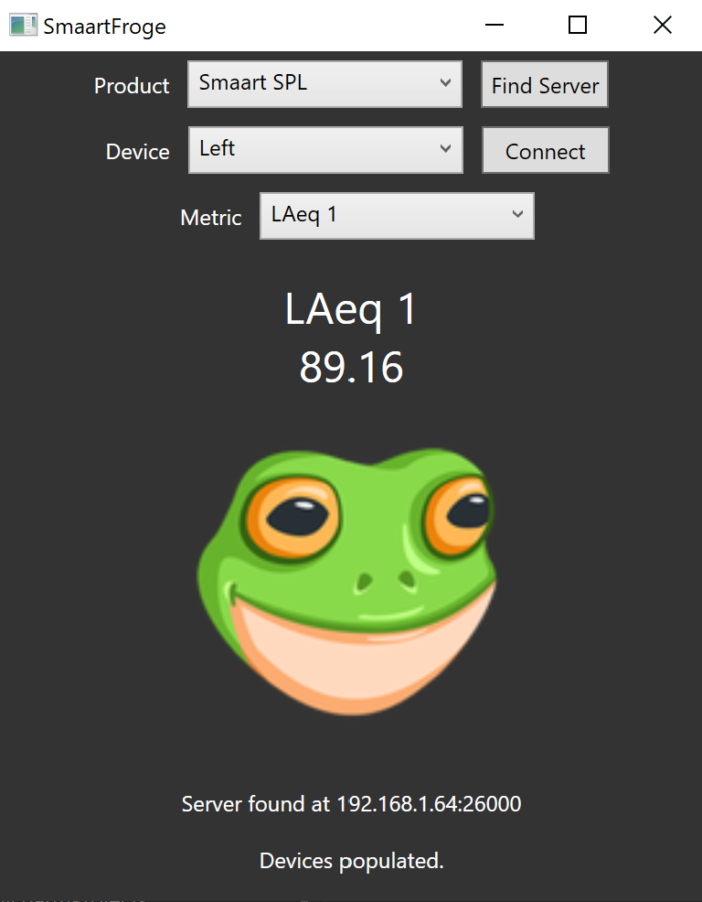

# SmaartFroge
Let froge judge you based on SPI levels from the Smaart API  

Only tested with latest Smaart SPL demo. You must have at least one active calibrated input and start logging in order to connect to receive the SPL data stream.  
[Grab the latest release here](https://github.com/camprevail/SmaartFroge/releases/latest).   

## TODO:
* More meme factor
* Contemplate life choices
* Do something more productive
* Like actually learn C# instead of making chatGPT write this entire thing
* ...Profit?

